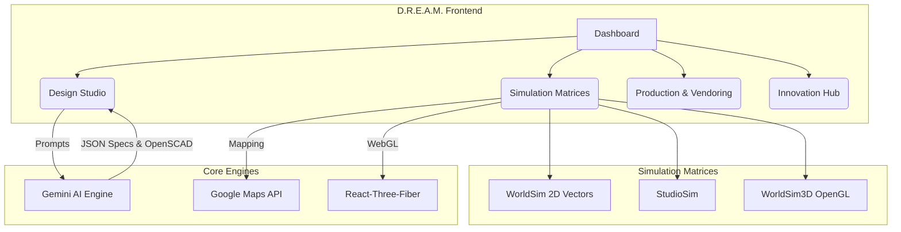
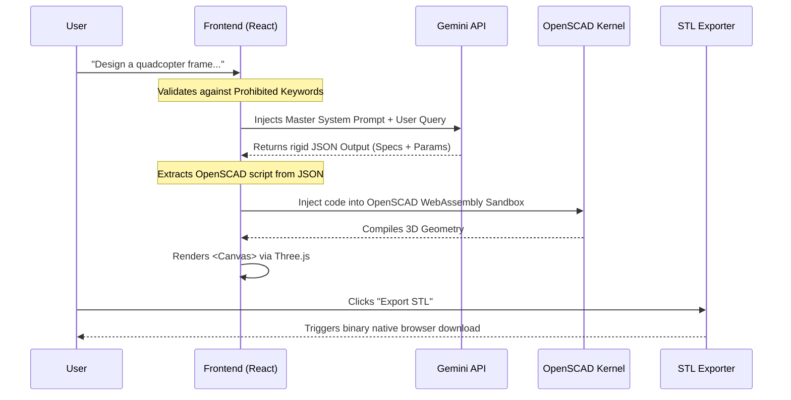
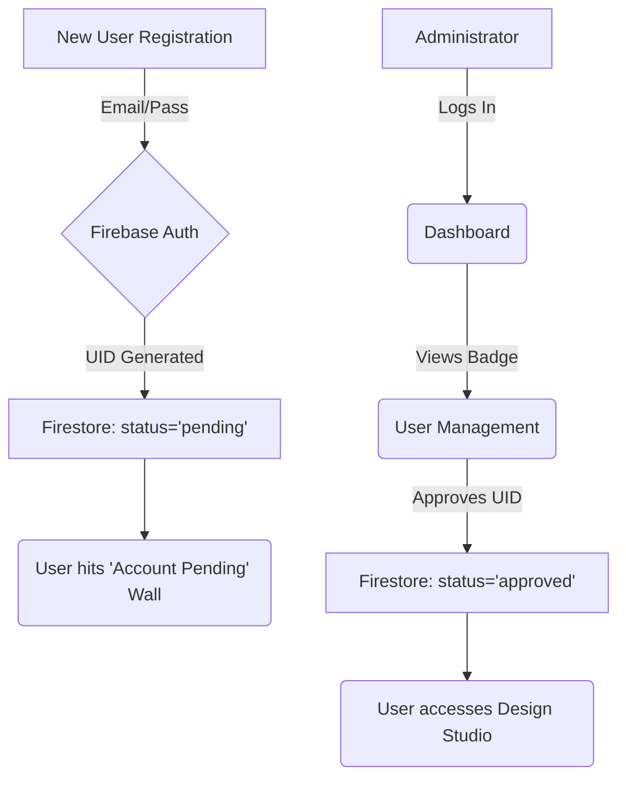

# D.R.E.A.M. Developer Architecture Guide

This comprehensive reference manual maps the architecture, data flows, and ecosystem integrations powering the D.R.E.A.M. (Digital Rendering & Engineering AI Matrix) application.

---

## 🏗️ 1. Core Ecosystem Structure

The application is split into three primary interconnected domains: **Design Studio**, **Simulation Ecosystem**, and **Production / Administration**.



### Application Stack
* **Framework:** React 18, Vite, TypeScript
* **Styling:** Tailwind CSS (Glassmorphism & Zinc styling)
* **Routing:** React Router DOM v6
* **Database & Auth:** Google Firebase (Firestore, Authentication)
* **AI:** Google Gemini API 
* **3D Engines:** `@react-three/fiber`, `@react-three/drei`, Three.js
* **GIS Engine:** `@react-google-maps/api`
* **Cloud Infrastructure:** Google Cloud Run, Cloud Build (`dream-giga` container natively hosted at `dreamgiga.ai`)

---

## 🧠 2. Generative AI Pipeline

The heart of the **Design Studio** is the Gemini generative pipeline processing user prompts into physical 3D geometries.



---

## 🌍 3. Simulation Architecture (WorldSim & WorldSim3D)

The simulation array consists of two completely independent engines designed for stability and high-fidelity testing:

### **WorldSim** (Stable GIS Engine)
This tab uses `GoogleMap` locked at a 45-degree angle `satellite` mode. Instead of using complex and unstable WebGL components, we translate X-Plane keyboard kinematics (`W,A,S,D,C`) into programmatic Map mutations (`setHeading`, `panTo`) over a reliable flat vector projecting a pseudo-3D feel.

### **WorldSim3D** (Pure WebGL Simulator)
This tab mounts a raw `@react-three/fiber` environment completely isolated from Google Maps. 
- A massive `Grid` component generates an infinite 3D room.
- A procedural `DroneModel` is generated natively from Three.js primitives.
- A custom `FlightCamera` intercepts `W` (Pitch Down), `S` (Pitch Up), `A` (Yaw Left), `D` (Yaw Right), `arrow_keys` (Engine Thrust) within a permanent `requestAnimationFrame` (`useFrame`) loop, physically flying the Three.js viewport continuously through the digital WebGL canvas.

```mermaid
graph LR
    subgraph Input Handlers
    K[W/A/S/D] --> P(Pitch/Yaw/Roll)
    T[Arrows/Space] --> V(Thrust/Elevation)
    end
    
    subgraph WorldSim3D Rendering Loop
    P --> C(FlightCamera)
    V --> C
    C -->|mutates| M[(useThree().camera.position)]
    M -->|useFrame(delta)| R[Three.js Renderer]
    end
```

---

## 🔐 4. Authentication & Administration Flows

To ensure production security across the application, Firebase operates as the backbone with native Role-Based Access Control (RBAC).

* **Registration:** Users pass through Firebase Auth. Automatically flagged as `pending` inside the Firestore `users` collection.
* **Approval Pipeline:** Global Admins use the `UserManagementPage` to elevate `pending` accounts to `approved` or block them gracefully.
* **Profile Management:** Users can safely update passwords dynamically using Firebase Tokens and edit display data explicitly constrained to their UID using Firestore Native Security Rules.



---

## 📦 5. Core Files & Directories

* `src/components/ThemePanel.tsx`: The primary wrapper for every UI panel establishing the global translucent zinc/glassmorphism aesthetics.
* `src/services/gemini.ts`: Centralizes all AI logic, enforcing the strict JSON system prompts before sending payloads to Google.
* `src/pages/WorldSimPage.tsx`: Stable 2D Vector simulation module wrapped around `@react-google-maps/api`.
* `src/pages/WorldSim3DPage.tsx`: Next-generation OpenGL WebGL simulation mounting the primitive flight camera engines without strict dependencies.
* `src/pages/StudioPage.tsx`: The architectural layout tying OpenSCAD, Gemini, and the Project sidebars natively into the Design loop.
* `deploy.ps1`: Natively parses local ignored `.env.local` arrays, runs Vite `build` instances, and pipes extracted production variables cleanly into `--set-build-env-vars` onto the `gcloud` remote builder.

---

## 🎨 6. UI/UX Standards

To maintain a clean and dense interface suitable for complex engineering pipelines:
- **Action Toolbars:** Buttons operating inside control planes, editors, or simulation trackers should **purely use icons** (`lucide-react`) without inline text labels. Explicit UX assistance must be relegated to the native HTML `title=""` attribute, triggering standard browser hover-tips to conserve screen real-estate.

---

> **Note to Future Developers:** When updating environment variables, ensure both `.env.local` (local development) and the corresponding `deploy.ps1` extraction loops are updated symmetrically to prevent missing variables bleeding into the GCP Cloud Run containers.
