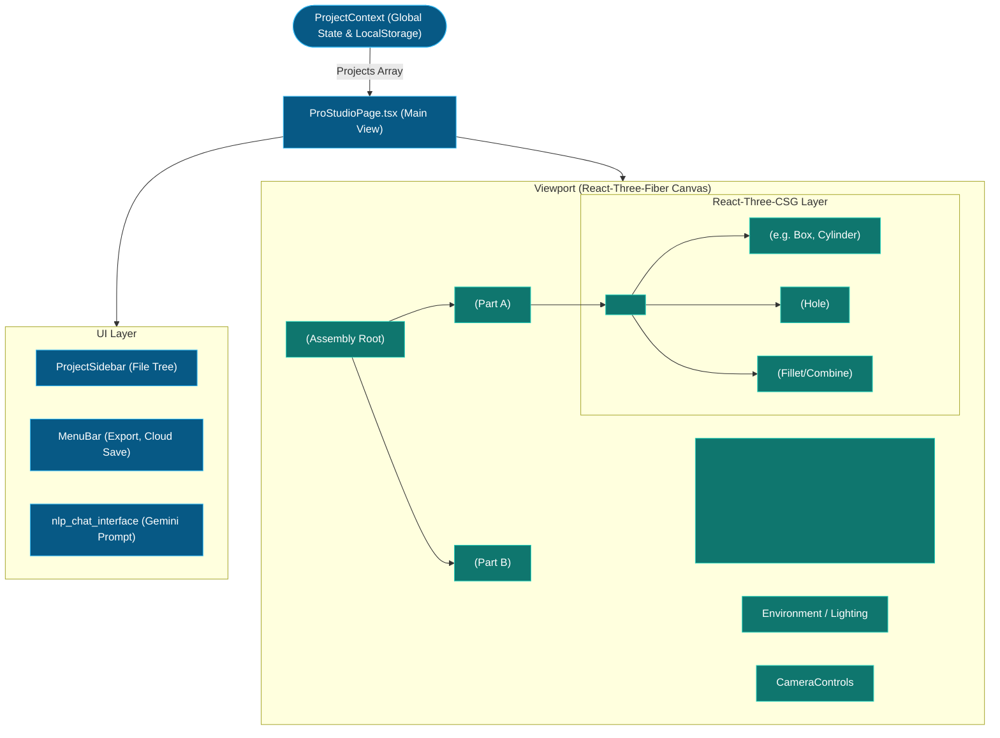
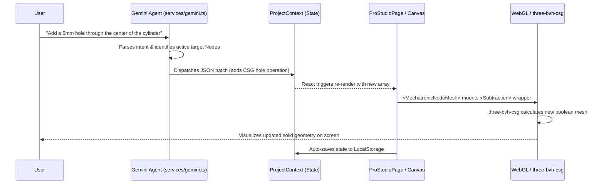

# ProStudio Architecture & Integration Report

## 1. Executive Summary
ProStudio is the core 3D engineering and assembly environment within the DREAM platform. It acts as a parametric, history-based Constructive Solid Geometry (CSG) modeling tool built entirely in the browser. This document provides a technical overview of ProStudio’s architecture to aid third-party developers in integrating external software, specifically focusing on data handoffs to downstream environments like **StudioSim** (physics simulation) and **TacticalSim** (fleet/world simulation).

---

## 2. Codebase Structure & File Organization

The application is structured around a modular React/Vite layout, cleanly separating routing logic, 3D rendering components, global state, and external service bindings.

```mermaid
graph TD;
    Root["mgi-dream/ (Project Root)"]

    %% Pages
    Pages["pages/"]
    ProStudioPage["ProStudioPage.tsx (Core CSG Editor)"]
    StudioSimPage["StudioSimPage.tsx (Physics Sim)"]
    WorldSimPage["WorldSimPage.tsx (Tactical Sim)"]
    
    %% Contexts
    Contexts["contexts/"]
    ProjectContext["ProjectContext.tsx (Global CAD State)"]
    AuthContext["AuthContext.tsx (Firebase Auth)"]

    %% Components
    Components["components/"]
    ProjectSidebar["ProjectSidebar.tsx (Registry)"]
    MenuBar["MenuBar.tsx (File I/O)"]
    DesignInput["DesignInput.tsx (Chat/NLP UI)"]

    %% Services
    Services["services/"]
    FireBase["firebase.ts (DB/Storage config)"]
    Gemini["gemini.ts (AI prompting/parsers)"]

    %% Types
    Types["types.ts (Data Interfaces)"]

    Root --> Pages
    Root --> Contexts
    Root --> Components
    Root --> Services
    Root --> Types

    Pages --> ProStudioPage
    Pages --> StudioSimPage
    Pages --> WorldSimPage

    Contexts --> ProjectContext
    Contexts --> AuthContext

    Components --> ProjectSidebar
    Components --> MenuBar
    Components --> DesignInput

    Services --> FireBase
    Services --> Gemini
    
    classDef dir fill:#1e293b,stroke:#475569,stroke-width:2px,color:#fff;
    classDef file fill:#0f172a,stroke:#3b82f6,stroke-width:1px,color:#cbd5e1;
    class Root,Pages,Contexts,Components,Services dir;
    class ProStudioPage,StudioSimPage,WorldSimPage,ProjectContext,AuthContext,ProjectSidebar,MenuBar,DesignInput,FireBase,Gemini,Types file;
```



---

## 3. React Component Architecture

ProStudio heavily relies on `React-Three-Fiber` to mount 3D objects as declarative React components.



---

## 4. The Data Structure (The "SceneGraph")

The fundamental truth of a ProStudio project is its JSON representation, defined in `types.ts` and managed locally by the `ProjectContext`. 

### 4.1: `MechatronicNode`
Every part in the assembly is a `MechatronicNode`.
```typescript
export interface MechatronicNode {
    id: string;
    type: 'primitive' | 'imported_stl' | 'imported_circuit' | 'imported_dxf';
    shape?: 'box' | 'cylinder' | 'sphere' | 'screw_thread';
    dimensions?: [number, number, number];
    position: [number, number, number];
    rotation: [number, number, number];
    scale: [number, number, number];
    materialType: 'plastic' | 'metal' | 'fr4' | 'copper' | 'custom';
    color: string;
    csgStack?: CSGOperation[]; 
}
```

### 4.2: `CSGOperation`
Each node maintains a `csgStack`—an ordered list of topological modifiers.
```typescript
export interface CSGOperation {
    id: string;
    type: 'hole' | 'chamfer' | 'round' | 'taper' | 'countersink' | 'boolean_union' | 'boolean_subtract';
    params: { size: number; depth: number; position: [x,y,z]; axis: string; ... }
}
```

ProStudio treats this JSON as a pure mathematical recipe.

---

## 5. State Flow & The NLP Pipeline

This diagram explains how user inputs—specifically conversational engineering via Gemini—flow through the system to update the 3D mesh.



---

## 6. Integration Hooks for Downstream Applications

### 6.1: Integrating with **StudioSim** (Physics & FEA)
StudioSim is designed for rigid-body physics, thermal, and Finite Element Analysis (FEA).
*   **The Handoff**: StudioSim cannot easily digest real-time CSG React components. Therefore, ProStudio utilizes a pipeline (often routing to `generateOpenScadCode` in `services/gemini.ts`) to compile the JSON `MechatronicNode` graph into a single, water-tight, manifold **STL or STEP payload**.
*   **Third-Party Hook**: If you are bringing your own simulation software (e.g., Ansys, custom solvers), you should hook into the `activeProject.assetUrls.stl` property within the context. Retrieve this absolute baked mesh, combined with `activeProject.specs.materials` (which defines mass, density, and yield strength).

### 6.2: Integrating with **TacticalSim / WorldSim** (Fleet & Environment)
TacticalSim operates at a macro level (e.g., simulating 1,000 drones in a city scenario, found in `WorldSimPage.tsx` or `WorldSim3DPage.tsx`).
*   **The Handoff**: Loading 1,000 high-resolution CSG meshes will crash a browser. TacticalSim requires **Level of Detail (LOD) optimization** and kinematic models.
*   **Third-Party Hook**: Do not intercept the heavy STL. Instead, intercept the raw ProStudio JSON array (`nodes` in `ProjectContext`). Calculate a strict bounding box or a convex hull for each `MechatronicNode` directly from its mathematical `dimensions` and `position`.

---

## 7. Developing External Plugins

If you are writing a React-based plugin to manipulate ProStudio:
1.  **Read-Only Operations**: Subscribe to the `ProjectContext` via `const { projects } = useProject();`. Read the `projects` array to visualize BOMs or generate mass estimates in real-time.
2.  **Write Operations**: Dispatch updates via `updateProjectField` or write directly to the Firebase Collections via `services/firebase.ts`. The React UI will automatically hydrate and re-render the CSG operations upon receiving the new JSON state.
