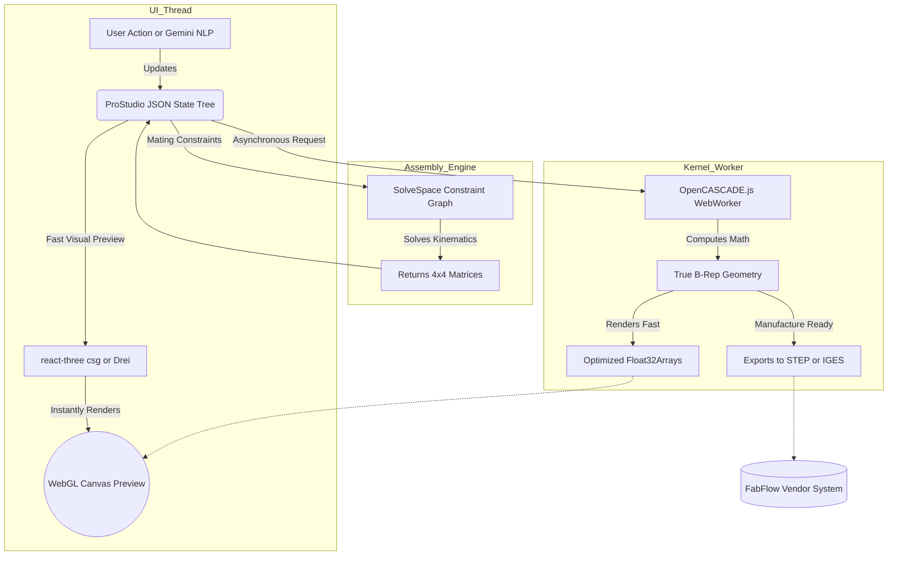

# ProStudio React-CAD Audit & Assembly Strategy Blueprint

This document serves as a rigorous technical audit of the current `@react-three/csg` implementations inside DREAM ProStudio, outlines the exact value derived from the user-provided `react-cad` reference library, and combines these lessons into a definitive execution flowchart for building a professional 3D assembly modeling kernel.

---

## 1. Analysis of Provided `react-cad` Reference Files
The `react-cad-main` repository you provided is an open-source React wrapper built around **OpenCASCADE.js**. 

**Why it is incredibly helpful:**
*   **WASM Worker Blueprint**: It successfully isolates the heavy C++ OpenCASCADE kernel inside a WebAssembly compiler, preventing the main React UI thread from freezing during complex topological queries. This perfectly validates our planned strategy.
*   **React Syntax to B-Rep Mapping**: It demonstrates how to parse standard React JSX elements (`<cylinder>`, `<difference>`) explicitly into mathematical B-Rep commands, rather than just throwing visual triangles at the GPU. 
*   **Legacy Context**: As you suspected, it relies on older React 17/18 paradigms and Webpack pipelines that aren't natively plug-and-play with our ultra-modern, Vite-powered `@react-three/fiber` ecosystem. Instead of forcing it to compile directly, we will extract its C++ Web Worker synchronization logic and build a modern, lightweight bridge natively into ProStudio.

---

## 2. React 3D CAD Audit: What Works vs. What Fails

We have pushed the standard `@react-three/csg` engine to its absolute breaking point inside ProStudio. Here are the exact lessons learned regarding rendering and modifying live CAD in the browser:

### ✅ What Works (The Strengths)
1.  **Lightning-Fast Visual Booleans**: Using `three-bvh-csg` (BSP-tree mathematics) allows users to subtract or unite shapes instantly at 60fps. It's fantastic for visual previewing and blocking out rough topologies.
2.  **Semantic Prop Binding**: Linking Three.js `<mesh>` positions/rotations directly to a centralized React `nodes` JSON graph allows our NLP engine (Gemini) to manipulate the scene natively (e.g., changing colors or translating objects via text).
3.  **Dynamic Rendering Contexts**: The ability to hot-swap materials, overlay edge highlights, and update boundaries asynchronously without dropping frames is a massive UX advantage over traditional C++ thick-client CAD software.

### ❌ What Does NOT Work (The Limitations)
1.  **Negative Scalar Corruption (The Mirror Bug)**: Because BSP engines evaluate "inside" vs "outside" using the triangle winding order (the direction the face points), applying a simple mathematical mirror (`scale=[-1,1,1]`) flips the triangles inside-out. The boolean engine assumes the solid is now a void, instantly corrupting the assembly. *Workaround implemented: We explicitly invert positional coordinate arrays manually instead of scaling.*
2.  **No True Sub-Object Picking (B-Rep Failure)**: You cannot naturally select an "Edge" or a "Face" to apply a clean 2mm fillet or chamfer. We had to build complex raycasting algorithms checking vector normals to "guess" which face the user clicked.
3.  **Destructive Mesh Degradation**: Repeating boolean operations (cutting a hole in a block that already has 5 holes) on triangulated meshes eventually introduces microscopic floating-point errors (Z-fighting or non-manifold tears). It cannot generate a mathematically mathematically perfect STEP file for FabFlow natively.

---

## 3. The Unified "Tomorrow" Strategy: Flow Chart

We will combine the speed of `@react-three/fiber` (what works) with the mathematical perfection of `OpenCASCADE WASM` (the `react-cad` lesson). 

**The Hybrid Execution Flowchart:**

### Next Steps & Architecture Overhaul Roadmap
1.  **Kernel Detachment**: Scaffold a Background Web Worker using Vite to import OpenCASCADE WASM (using lessons extracted from `react-cad-main`).
2.  **State Upgrading**: Upgrade the `MechatronicNode` interface to clearly separate **Dumb Meshes** (for fast dragging) from **Compiled Buffers** (the result of the OpenCASCADE worker).
3.  **Constraints Engine**: Inject `SolveSpace` WASM. Instead of manually moving coordinates across axes (which caused our bug today), users will declare relationships ("Face A is flush with Face B"). The solver dictates the final position.
